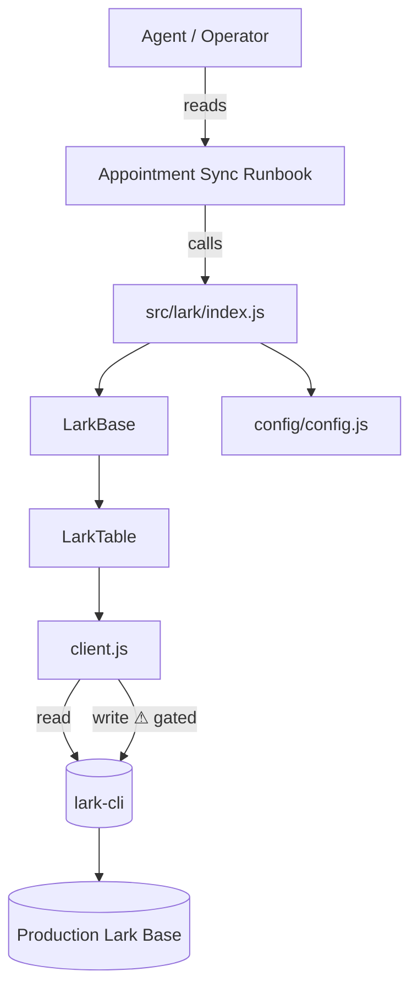

# Project Structure

```
LarkTunnel/
├── config/
│   ├── config.js          ← SINGLE SOURCE OF TRUTH (edit this)
│   └── secrets.txt        ← App ID / Secret (gitignored)
├── src/
│   ├── lark/              ← the wrapper library
│   │   ├── client.js      ← low-level lark-cli exec + SAFE_MODE gate
│   │   ├── LarkBase.js    ← a Base (app): resolve token, list tables, hand out tables
│   │   ├── LarkTable.js   ← a table: read / search / gated writes / link helpers
│   │   └── index.js       ← public entry: require('./src/lark')
│   └── workflow/
│       └── inputs.example.json  ← template for one appointment session
├── scripts/
│   └── verify-config.js   ← READ-ONLY check of config against the live Base
├── docs/                  ← this Obsidian vault
├── archive/
│   └── lark_core_legacy/  ← old forecast/sync project (kept for reference)
└── package.json
```

## Layering



- **config.js** is read by `index.js` and injected into `LarkBase` as the table
  registry.
- **client.js** is the only module that touches `lark-cli`. All writes pass
  through its `gatedWrite` (safe mode). See [[Production Guardrails]].

## What was archived

`archive/lark_core_legacy/` holds the previous project's forecast **sync**
tooling (`sync.js`, `local_db.*`, `alias-map.json`, `playground.original.js`,
`examples/`). It is **not part of this workflow** but kept in case any mapping
or batch logic is worth lifting later.

Related: [[Wrapper Library]] · [[Configuration]]
