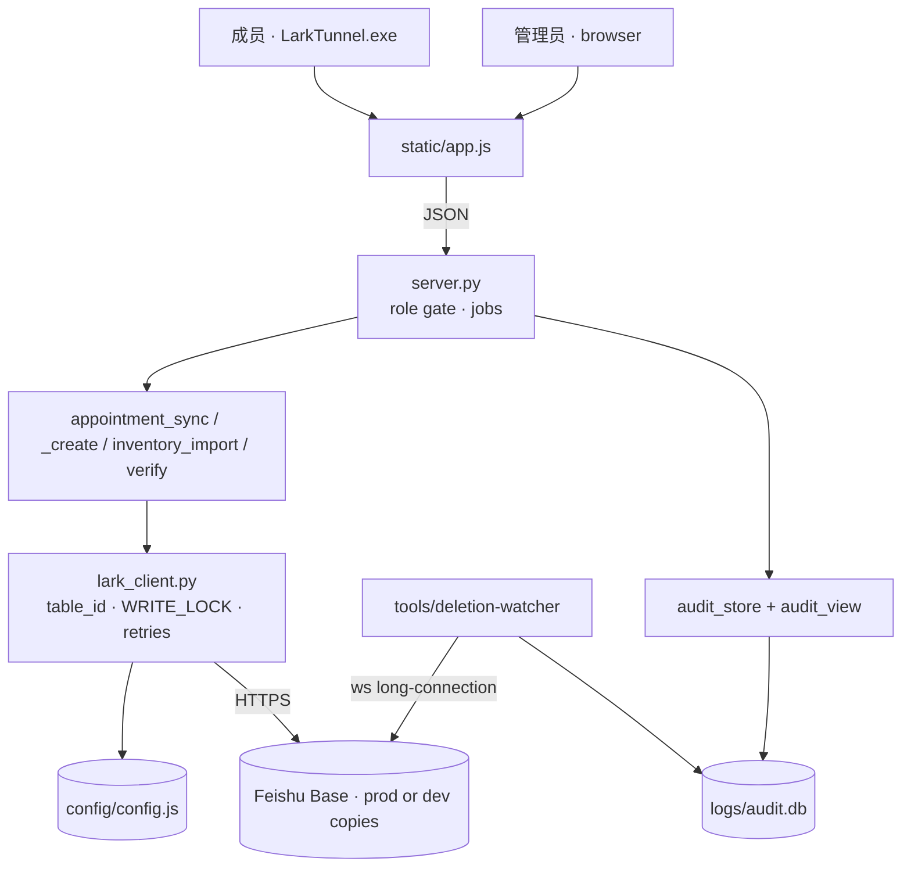

# Project Structure（LTS · 2026-10-02）

```
LarkTunnel/
├── config/
│   ├── config.js            ← SINGLE SOURCE OF TRUTH: base token, table ids, field names,
│   │                           warehouse map, dev-env maps, authTable (edit this)
│   ├── secrets.txt          ← legacy App ID/Secret (gitignored; superseded by ⚙ 设置 / bundled.bin)
│   └── operators-auto.json  ← machine-written open_id→name map (gitignored)
├── webapp/                  ← 到仓核对台 — PRIMARY tool. Pure stdlib Python, zero deps
│   ├── server.py            ← HTTP routes, role gate (_FEATURE_OF/_gate), job endpoints
│   ├── lark_client.py       ← Feishu client: auth, env resolution table_id(), retries, WRITE_LOCK
│   ├── appointment_sync.py  ← ② 计划同步 core (decision tree _plan_row, commit, fast recheck)
│   ├── appointment_create.py← ① 新建预约 (only creator of 5.6)
│   ├── inventory_import.py  ← 📦 库存导入 (only creator of 3.1 records)
│   ├── verify_assignments.py← ③ 核对 (read-only chain audit)
│   ├── file_parse.py        ← Excel/CSV parsing for 📄 解析 and 📦 导入
│   ├── audit_store.py / audit_view.py / identity_harvest.py ← 🗑️ 删除日志 (SQLite + enrichment)
│   ├── access_control.py / app_settings.py / apppaths.py / ops_log.py ← team access, DPAPI creds, paths, ops log
│   ├── sync_jobs.py         ← background jobs + single-flight commits
│   ├── desktop.py / LarkTunnel.spec / build.bat / bundle_secrets.py / make_icon.py ← exe build
│   ├── static/              ← app.js (one file, one section per tab), index.html, style.css, icons
│   ├── tests/               ← offline unittest suite (`npm test`) + integration_*.py (dev tables)
│   ├── dist-extras/使用说明.txt ← member-facing usage note shipped with the exe
│   └── run.bat / run-dev.bat / webapp-service.{bat,vbs} ← manual + Task Scheduler launchers
├── tools/deletion-watcher/  ← long-connection event listener → logs/audit.db (needs lark-oapi)
├── src/lark/, src/workflow/ ← Node wrapper library + CLI import (secondary path; needs lark-cli)
├── scripts/verify-config.js ← READ-ONLY schema check of config.js against the live Base
├── docs/                    ← this Obsidian vault (start: 00 Home/Start Here.md)
├── logs/                    ← audit.db, ops.jsonl, service logs (gitignored)
└── package.json             ← npm scripts: test, test:*, verify:config, import:inventory
```

## Layering


```mermaid
flowchart TD
    M[成员 · LarkTunnel.exe] --> UI[static/app.js]
    A[管理员 · browser] --> UI
    UI -->|JSON| S[server.py<br/>role gate · jobs]
    S --> SYNC[appointment_sync / _create / inventory_import / verify]
    S --> AUD[audit_store + audit_view]
    SYNC --> LC[lark_client.py<br/>table_id · WRITE_LOCK · retries]
    LC --> CFG[(config/config.js)]
    LC -->|HTTPS| LARK[(Feishu Base · prod or dev copies)]
    W[tools/deletion-watcher] -->|ws long-connection| LARK
    W --> DB[(logs/audit.db)]
    AUD --> DB
```

- **One writer per table**: 📦 creates 3.1 · ① creates 5.6 · ② updates 3.1 / creates 5.x /
  edits already-linked 5.6 · ③ 🔍 📄 🗑️ never write to Feishu.
- **Every Feishu write** goes through `lark_client._api` under `WRITE_LOCK` with a fresh
  `client_token`; every write flow is plan (read-only) → approve → commit → read-back.
- The Node `src/` path is kept as an agent/CLI fallback and for `verify:config`; the
  webapp does not depend on it.

Related: [[Start Here]] · [[Wrapper Library]] · [[Configuration]]
