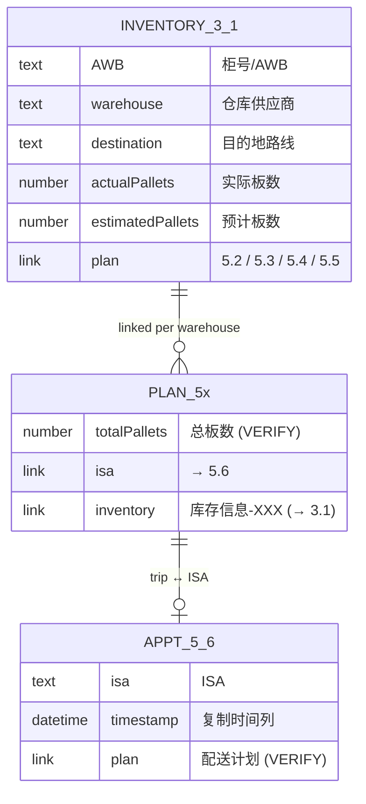

# Table Registry

All tables live in one Base: `C13Zb8l6WassnesyRJhufdvLsFe` (see [[Configuration]]).
Reference them by **label** in code (`base.tableByLabel('3.1')`).

| Label | Table id | Role |
|---|---|---|
| `3.1` | `tblbJiIHMwND2OGX` | **Inventory / shipment master.** One row per shipment. Holds pallet counts and per-warehouse links to delivery plans. |
| `5.6` | `tblxiClBxvCku7rT` | **ISA appointments.** One row per ISA. Holds the `复制时间列` timestamp and links to a delivery trip. |
| `5.2 BESTAR-CAL` | `tblILN4i0RIdpPhz` | Delivery plans (trips) for **BESTAR** — Calgary. |
| `5.3 WBLL-EDM` | `tblacP4Rr6L5AXco` | Delivery plans (trips) for **WBLL** — Edmonton. |
| `5.4 VAST-VAN` | `tblHIdhwKuqvdM7I` | Delivery plans (trips) for **VAST** — Vancouver. |
| `5.5 GFL-VAN` | `tbl2QdSLd53g987f` | Delivery plans (trips) for **GFL** — Vancouver. |

## Relationships

- A **3.1** shipment links to exactly one **5.x** delivery trip (the warehouse
  decides which table + which link field).
- A **5.x** trip correlates to one **5.6** ISA appointment.
- The link between 3.1 and 5.x is **two-way**: the 5.x side back-link is
  `库存信息-XXX` (see [[Warehouse & Account Map]]).

Related: [[Field Glossary]] · [[Warehouse & Account Map]]
