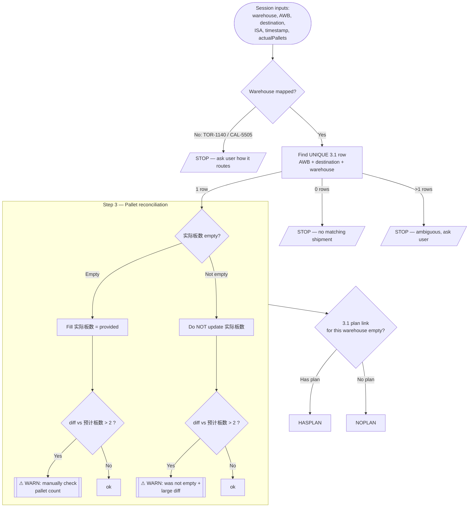
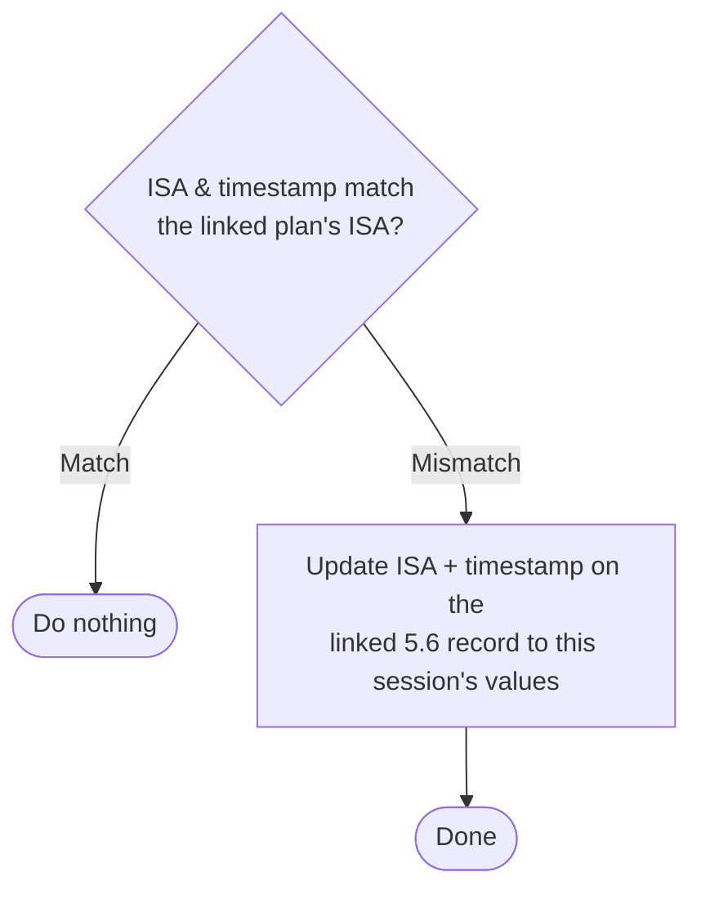
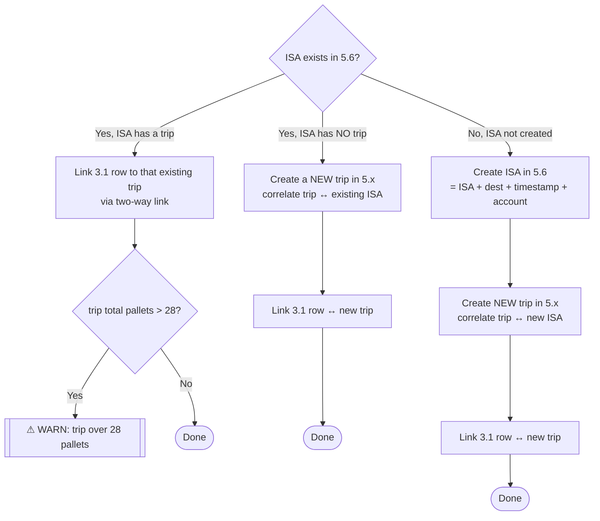

# Decision Tree

Visual companion to the [[Appointment Sync Runbook]]. Same logic, faster to scan.

## Overall flow

## Branch: row **has** a delivery plan

## Branch: row has **no** delivery plan

## Warning summary (collect, report at end)

| # | Condition | Message |
|---|---|---|
| W1 | 实际板数 was empty **and** \|provided − 预计板数\| > 2 | "Pallet count filled but differs from estimate by >2 — manually check." |
| W2 | 实际板数 was **not** empty **and** \|provided − 预计板数\| > 2 | "实际板数 already populated; provided differs from estimate by >2." |
| W3 | Linked/【newly linked】 trip total pallets > 28 | "Trip exceeds 28-pallet cap." |

Related: [[Appointment Sync Runbook]] · [[Warehouse & Account Map]]
